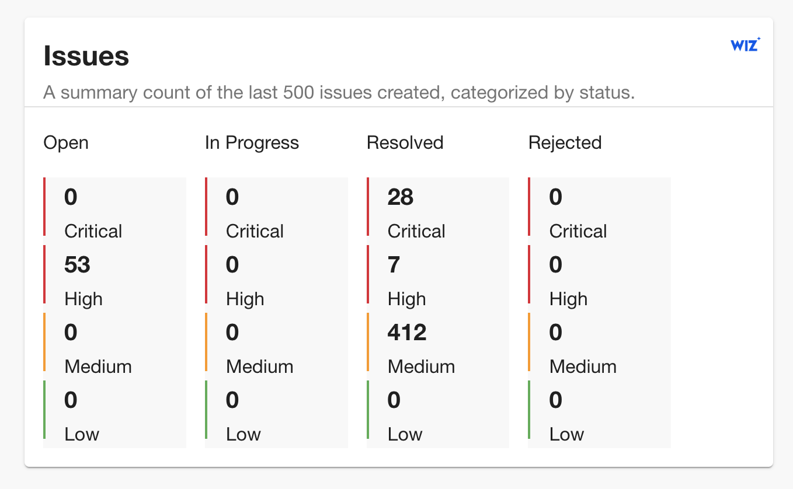

# Wiz Plugin for Backstage

.

.
.
.

## Features

Wiz Issues Component:

- Shows issues for the project, grouped by Controls

Issues widget Component:

- Shows number of open issues grouped by severity

Issues chart Component:

- Shows graph with number of resolved and open issues over time

Severity chart Component:

- Shows graph of issues grouped by severity, over time

## Prerequisites

To begin using Wiz plugin, you will need the following parameters:

- API endpoint URL
- OAuth token

In order to retrieve those, you can read official documentation (https://win.wiz.io/reference/prerequisites) where it is described how to obtain them.

## Getting started

1. Add proxy configuration for WIZ:

```yaml
// app-config.yaml
proxy:
  '/wiz/api':
  target: https://api.<TENANT_DATA_CENTER>.app.wiz.io/graphql
  headers:
    Accept: 'application/json'
    Content-Type : 'application/json'
    Authorization: 'Bearer ${WIZ_API_TOKEN}'
```

The Wiz GraphQL API has a single endpoint
https://api.<TENANT_DATA_CENTER>.app.wiz.io/graphql, where <TENANT_DATA_CENTER> is the Wiz regional data center your tenant resides, e.g., us1, us2, eu1 or eu2.

Your OAuth token is generated following these steps (https://win.wiz.io/reference/quickstart)

After generating and obtaining your OAuth token, export it to your shell.

```bash
export WIZ_API_TOKEN=xxx-xxx-xxx
```

3. Add plugin component to your Backstage instance:

```ts
// packages/app/src/components/catalog/EntityPage.tsx
import {
  EntityWizIssues,
  isWizAvailable,
  EntityIssuesWidget,
  EntityIssuesChart,
  EntitySeverityChart,
} from '@roadiehq/backstage-plugin-wiz';
```

### Add widgets: EntityIssuesWidget, EntityIssuesChart, EntitySeverityChart

In the `packages/app/src/components/catalog/EntityPage.tsx` under `overviewContent` add the following, based on which card (widget) you want to display:

```jsx
<EntitySwitch>
  <EntitySwitch.Case if={isWizAvailable}>
    <Grid item md={6}>
      <EntityIssuesWidget />
    </Grid>
  </EntitySwitch.Case>
</EntitySwitch>

<EntitySwitch>
  <EntitySwitch.Case if={isWizAvailable}>
    <Grid item md={6}>
      <EntityIssuesChart />
    </Grid>
  </EntitySwitch.Case>
</EntitySwitch>

<EntitySwitch>
  <EntitySwitch.Case if={isWizAvailable}>
    <Grid item md={6}>
      <EntitySeverityChart />
    </Grid>
  </EntitySwitch.Case>
</EntitySwitch>
```

### EntityWizIssues

In the `packages/app/src/components/catalog/EntityPage.tsx` under `serviceEntityPage` add the following:

```jsx
<EntityLayout.Route path="/wiz" title="WIZ">
  <EntityWizIssues />
</EntityLayout.Route>
```

This will add a new tab with all the issues for the project id you have specified in annotations.

## How to use add correct annotations

1. Add annotation to the yaml config file of a component:

```yaml
metadata:
  annotations:
    wiz/project-id: <your-project-id>
```
